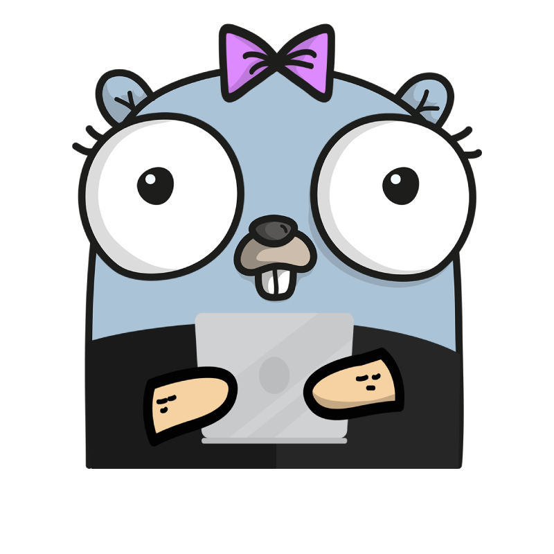

<div align="center">
  
  <h1>
     
    BACKEND WITH GO
    
  </h1>
   
</div>

<div>
  <h2>Table of contents</h2>
  <ol>
    <li>
      <a href="#installation"> Installation </a>
    </li>
    <ol>
      <li>
        <a href="#macos-using-homebrew">MacOS using Homebrew</a>
      </li>
      <li>
        <a href="#windows-using-chocolatey">Windows using Chocolatey</a>
      </li>
      <li>
        <a href="#linux-using-apt">Linux using apt</a>
      </li>
      <li>
        <a href="#download-go">Download Go</a>
      </li>
      <li>
        <a href="#check-installed-go-version">Check installed Go version</a>
      </li>
    </ol>
    <li>
      <a href="#introduction">Introduction</a>
    </li>
    <ol>
      <li>
        <a href="#what-is-go">What is Go?</a>
      </li>
      <li>
        <a href="#why-using-go">Why using Go?</a>
      </li>
    </ol>
    <li>
      <a href="#syllabus">Syllabus</a>
    </li>
    <ol>
	<li>
	    <a href="#-----first-steps--------the-basics-------hello-world-----variables-and-data-types-----println-function-----operators-----sequence-of-values-----reading-values----flow-controls-------conditionals-----switch-----loops-----break-and-continue---%EF%B8%8F-functions-and-pointers-%EF%B8%8F------declaring-functions-----anonymous-functions-----panic-functions-----recursive-functions-----variadic-functions-----recover-functions-----pointers---%EF%B8%8F-data-structures-%EF%B8%8F------arrays-----slices-----maps---%EF%B8%8F-structs-enums-and-interfaces-%EF%B8%8F------structs-----enums-----interfaces-----access-modifiers----packages-------create-a-package-----documentation-----imports-----main-----core-packages-----code-examples---">
			    First steps
	    </a>
	</li>
	<li>
     	   <a href="#---------threads---------understanding-concurrency------goroutines------channels------code-examples--">Threads</a>
        </li>
	<li>
     	   <a href="#---------oop---------what-is-oop------classes-objects-and-instances------encapsulation------abstraction------composition-pattern------inheritance------polymorphism------code-examples-">OOP</a>
        </li>
	<li>
     	   <a href="#---------backend------------databases---------sql------nosql------normalization-rules------mysql------postgresql------mongodb------gorm------api---------rest------soap------authentication------caching---------cdn------server-side------client-side------testing---------testing-principle------logs-errors-and-performance------unit-testing------integration-test-----code-examples-">Backend</a>
        </li>
    </ol>
   
  </ol>
</div>

<div>
  <h2>Installation</h2>  
  <h3>MacOS using Homebrew</h3>
  <p>To install Go on MacOS using the terminal you can use the following command (in case you have previously installed homebrew).</p>
</div>

```bash
  brew install go
```

<div>
  <h3>Windows using Chocolatey</h3>
  <p>To install Go on Windows using PowerShell you can use the following command (in case you have previously installed Chocolatey).</p>
</div>

```bash
  choco install -y golang
```

<div>
  <h3>Linux using apt</h3>
  <p>To install Go on Ubuntu using the terminal you can use the following command.</p>
</div>

```bash
  sudo apt install golang-go
```
<div>
  <h3>Download Go</h3>
  <p>To download and install Go from the documentation, you can access the link below.</p>
  <a href="https://go.dev/dl/">Download Go</a>
</div>

<div>
  <h3>Check installed Go version</h3>
  <p>Run the following command to check the installed version.</p>
</div>

```bash
  go version
```
<div>
  <br/>
</div>

**[⬆ Back to top](#table-of-contents)**

<div align="justify">
  <h2>Introduction</h2>
  <h3>What is Go?</h3>
  
  <p>Go is an open-source programming language focused on simplicity, reliability, and efficiency. Go was originally designed at Google in 2007 by Rob Pike, and Ken Thompson and became an open-source project publicly in 2012. At the time, Google was growing quickly, and the code being used to manage its infrastructure was also growing quickly in both size and complexity. Programmers began to feel that this large and complex codebase was slowing them down so they decided that they needed a new programming language focused on simplicity and quick performance.

</p>
  <br> <br>
  
  <p>Go is also a compiled and concurrent programming language, its syntax is a mix between C and Python. It is also statically typed, which means that the variable type cannot change its type throughout the program (it isn't necessary to declare the type, meaning it is dynamically typed or uses duck typing). It doesn't use the “;” but it does use curly braces to define a block of code. It stands out at the level of concurrency, in Go there are no threads as such but there are "Goroutines" that are lighter threads (this helps optimize resources). It is more of a systems language than of applications. It's more useful for the Backend (at microservices or data processing). It allows object-oriented programming but not in the conventional way, it has no inheritance, and polymorphism will be done through interfaces. It doesn't have exceptions which adds unnecessary complexity.</p>
<br>
</div>

<div align="justify">
  <h3>Why using Go?</h3>
  <ol>
    <li><b>Is fast and cross-platform compatible:</b> As a compiled language, Go written code is directly translated into formats that a processor understands and runs directly. Go has been proven to be generally faster than languages like Java and Python, which enhances the availability and reliability of services. Furthermore, it is possible to compile a single Go codebase into multiple operating systems (Eg. Windows, Linux, and macOS) and hardware architectures (Eg. x86, ARM, etc.).</li>
    <li><b>Is easy to learn:</b> Using Go is easy for software developers, particularly if they already have a solid foundation in C or Java. While the keywords and syntax may slightly differ, Go has the same procedural approach that programmers would familiarize in no time. </li>
    <li><b>Is well-scaled:</b> What makes Go a scalable language is its ability to support concurrency. It has Goroutines, which are functions that can run simultaneously and independently. Goroutines take up only 2 kB of memory, which makes them scalable when the need for running multiple concurrent processes arises.</li>
    <li><b>Has static typing:</b> Go’s method of storing variable values is more efficient than other languages which provides a higher memory and performance. If you define an int 32 variable in Go it takes four bytes of memory.</li>
    <li><b>Comprehensive programming tools:</b> As an open-source initiative, there are no issues in getting the necessary development tools. There are various editors, IDEs, and plugins that can be downloaded to <a href="https://go.dev/wiki/IDEsAndTextEditorPlugins">start with this language.</a></li>
    <li><b>Rich Standard Library:</b> Go comes with a powerful standard library that offers a variety of tools for building applications. It includes packages for tasks like <a href="https://pkg.go.dev/net@go1.21.6">networking</a>, <a href="https://pkg.go.dev/time@go1.21.6">working with time</a>, <a href="https://pkg.go.dev/strings@go1.21.6">manipulating strings</a>, <a href="https://pkg.go.dev/fmt@go1.21.6">format I/O</a>, and more, reducing the need for external dependencies.</li>
    <li><b>Built-in Testing and Benchmarking:</b> Go includes a built-in <a href="https://pkg.go.dev/testing">testing package</a> that enables developers to create automated tests for their code without the explicit need to depend on third-party frameworks. The testing package also provides benchmarking features, allowing developers to measure and compare the performance of their code.</li>
    <li><b>Go Doc Comments:</b> In Go, you can document your code by adding comments before functions and declarations. By utilizing the <a href="https://pkg.go.dev/go/doc@master">go/doc</a> package, you can generate documentation effortlessly. Furthermore, a web version of the documentation for public packages is automatically generated and hosted on <a href="https://pkg.go.dev/">pkg.go.dev</a>.</li>
  </ol>
</div>

<div>
  <br/>
</div>

**[⬆ Back to top](#table-of-contents)**

<div align="justify">
  <h2>Syllabus</h2>
	
  <h3>
	  <details >
  <summary>🐾 First steps 🐾</summary>
  <br>
    
  <details >
  <summary>🍼 The basics 🍼</summary>
	
  <br>
  <p>🦫 <a href="https://github.com/lara-vel-dev/backend-with-golang/blob/main/the-basics/01-hello-world/README.md"> Hello World! </a></p>
  <p>🦫 <a href="https://github.com/lara-vel-dev/backend-with-golang/blob/main/the-basics/02-variables-and-data-types/README.md"> Variables and data types </a></p>
  <p>🦫 <a href=""> Println function </a></p>
  <p>🦫 <a href=""> Operators </a></p>
  <p>🦫 <a href=""> Sequence of values </a></p>
  <p>🦫 <a href=""> Reading values </a></p>
  
</details>
  

<details >
  <summary>🔁 Flow controls 🔁</summary>
	
  <br>
  <p>🦫 <a href=""> Conditionals </a></p>
  <p>🦫 <a href=""> Switch </a></p>
  <p>🦫 <a href=""> Loops </a></p>
  <p>🦫 <a href=""> Break and Continue </a></p>
</details>

<details >
  <summary>🛠️ Functions and pointers 🛠️</summary>
	
  <br>
  <p>🦫 <a href=""> Declaring functions </a></p>
  <p>🦫 <a href=""> Anonymous functions </a></p>
  <p>🦫 <a href=""> Panic functions </a></p>
  <p>🦫 <a href=""> Recursive functions </a></p>
  <p>🦫 <a href=""> Variadic functions </a></p>
  <p>🦫 <a href=""> Recover functions </a></p>
  <p>🦫 <a href=""> Pointers </a></p>
  
</details>

<details >
  <summary>🛠️ Data structures 🛠️</summary>
	
  <br>
  <p>🦫 <a href=""> Arrays </a></p>
  <p>🦫 <a href=""> Slices </a></p>
  <p>🦫 <a href=""> Maps </a></p>

</details>

<details >
  <summary>⚙️ Structs, enums and interfaces ⚙️</summary>
	
  <br>
  <p>🦫 <a href=""> Structs </a></p>
  <p>🦫 <a href=""> Enums </a></p>
  <p>🦫 <a href=""> Interfaces </a></p>
  <p>🦫 <a href=""> Access modifiers </a></p>

</details>

<details >
  <summary>📦 Packages 📦</summary>
	
  <br>
  <p>🦫 <a href=""> Create a package </a></p>
  <p>🦫 <a href=""> Documentation </a></p>
  <p>🦫 <a href=""> Imports </a></p>
  <p>🦫 <a href=""> Main </a></p>
  <p>🦫 <a href=""> Core packages </a></p>

</details>

  <p>🦫 <a href=""> Code examples </a></p>

</details>
  </h3>

 <h3>
    <details >
    <summary>🧵 Threads 🧵</summary>
	
   <br>
   <p>🦫 <a href=""> Understanding concurrency </a></p>
   <p>🦫 <a href=""> Goroutines </a></p>
   <p>🦫 <a href=""> Channels </a></p>
   <p>🦫 <a href=""> Code examples </a></p>
  
</details>
 </h3>

<h3>
    <details >
    <summary>🤓 OOP 🤓</summary>
	
   <br>
   <p>🦫 <a href=""> What is OOP? </a></p>
   <p>🦫 <a href=""> Classes, objects and instances </a></p>
   <p>🦫 <a href=""> Encapsulation </a></p>
   <p>🦫 <a href=""> Abstraction </a></p>
   <p>🦫 <a href=""> Composition pattern </a></p>
   <p>🦫 <a href=""> Inheritance </a></p>
   <p>🦫 <a href=""> Polymorphism </a></p>
   <p>🦫 <a href=""> Code examples </a></p>
  
</details>
</h3>

<h3>
    <details >
    <summary>🧰 Backend 🧰</summary>
	
   <br>
   <details >
    <summary>⊱ Databases ⊰</summary>
	
   <br>
   <p>🦫 <a href=""> SQL </a></p>
   <p>🦫 <a href=""> NoSQL </a></p>
   <p>🦫 <a href=""> Normalization rules </a></p>
   <p>🦫 <a href=""> MySQL </a></p>
   <p>🦫 <a href=""> PostgreSQL </a></p>
   <p>🦫 <a href=""> MongoDB </a></p>
   <p>🦫 <a href=""> GORM </a></p>
   
</details>
<details >
    <summary>📡 API 📡</summary>
	
   <br>
   <p>🦫 <a href=""> REST </a></p>
   <p>🦫 <a href=""> SOAP </a></p>
   <p>🦫 <a href=""> Authentication </a></p>
   
</details>

<details >
    <summary>👾 Caching 👾</summary>
	
   <br>
   <p>🦫 <a href=""> CDN </a></p>
   <p>🦫 <a href=""> Server Side </a></p>
   <p>🦫 <a href=""> Client Side </a></p>
   
</details>

<details >
    <summary>🧪 Testing 🧪</summary>
	
   <br>
   <p>🦫 <a href=""> Testing principle </a></p>
   <p>🦫 <a href=""> Logs, errors and performance </a></p>
   <p>🦫 <a href=""> Unit testing </a></p>
   <p>🦫 <a href=""> Integration test </a></p>
  
</details>
   
  <p>🦫 <a href=""> Code examples </a></p>
</details>
</h3>

</div>

<div>
  <br/>
</div>

**[⬆ Back to top](#table-of-contents)**

<div align="center">
  <h2>Contributors</h2>
  <a align="center" href="https://github.com/EduDN" >
    
  </a>
  <a align="center" href="https://github.com/lara-vel-dev" >
    
  </a>
</div>